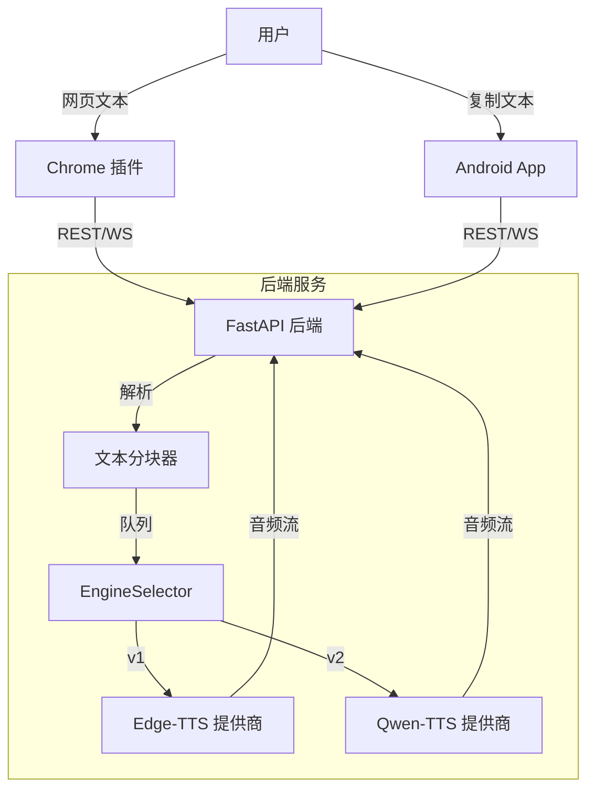

# TTS Bundles - 项目计划

## 1. 项目概览
一个综合性的文本转语音 (TTS) 解决方案，包含一个集中的 Python 后端和多个前端 (Chrome 插件, Android App)。

**核心目标:**
- **后端:** 高性能 Python API，处理文本分块和 TTS 合成。
- **前端:** 基于 Vue.js 的浏览器和移动端界面。
- **分阶段交付:**
    - **v1:** Edge-TTS + Chrome 插件。
    - **v2:** Qwen-TTS + Android App。

## 2. 技术栈

### 后端 (Backend)
- **框架:** FastAPI (Python) - 高性能，原生支持异步 (对 TTS 流式传输至关重要)。
- **TTS 引擎:**
    - `edge-tts` (调用 Microsoft Edge 在线 TTS 的库)。
    - `qwen-tts` (阿里通义千问语音模型/API)。
- **任务队列 (可选):** 如果生成时间较长，可能需要 Celery 或简单的 `asyncio` 后台任务。
- **格式:** 音频流 (Stream MP3/WAV)。

### 前端 1: Chrome 插件 (Chrome Extension)
- **框架:** Vue 3。
- **构建工具:** Vite (配合 `@crxjs/vite-plugin` 以获得最佳开发体验)。
- **功能:**
    - 内容脚本 (Content Script): 提取当前网页文本 (特别针对 Gemini/LLM 界面优化)。
    - 弹窗/侧边栏 (Popup/Sidepanel): 播放控制，语音选择，设置。
    - 后台 (Background): 处理 API 通信。

### 前端 2: Android App
- **框架:** Vue 3 + Ionic Framework (Capacitor)。
    - *注意:* Electron 不直接支持 Android。Capacitor 是目前将 Web/Vue 应用打包为原生 Android 应用的行业标准方案。
- **功能:**
    - 剪贴板监听 (读取复制的文本)。
    - 后台音频播放 (屏幕关闭后继续朗读)。

## 3. 架构设计

## 4. 实施细节与技术调研

### 后端实现 (Python)
- **Edge-TTS:** 使用 `edge-tts` 库的 `Communicate.stream()` 方法实现异步流式输出。
- **Qwen-TTS:** 使用阿里 `dashscope` SDK (`MultiModalConversation` 或 `QwenTtsRealtime`)。需要配置 `DASHSCOPE_API_KEY`。

### Chrome 插件架构 (Manifest V3)
由于 Manifest V3 中 Service Worker (Background) 无法持久播放音频且没有 DOM 访问权限，必须使用 **Offscreen Document** 方案。

1.  **Side Panel (侧边栏):** 用户主界面，负责业务逻辑、文本分块请求、播放控制。
2.  **Offscreen Document:** 一个隐藏的 HTML 页面，专门用于承载 `<audio>` 标签或 Web Audio API。
    - 侧边栏发送音频 URL 流给 Offscreen Doc。
    - Offscreen Doc 负责播放并向侧边栏汇报进度。
3.  **消息通信:** 使用 `chrome.runtime.sendMessage` 在各模块间传递指令。

## 5. 实施路线图

### 第一阶段: MVP (Edge-TTS + Chrome 插件)
**目标:** 使用微软免费的高质量语音朗读网页内容。

**后端任务:**
1.  **搭建 FastAPI:** 基础结构与 Pydantic 模型。
2.  **集成 Edge-TTS:** 封装调用 `edge-tts` python 库的异步接口。
3.  **分块逻辑 (Chunking):** 将长文章切分为段落/句子，避免超时并支持进度跳转。
4.  **API 接口:**
    - `POST /tts/stream`: 文本转语音流。
    - `GET /voices`: 获取可用语音列表。

**Chrome 插件任务:**
1.  **脚手架搭建:** Vue 3 + Vite + CRXJS。
2.  **文本提取:** 智能选择器以查找主要内容 (例如 readability.js 逻辑或特定站点的自定义选择器)。
3.  **音频播放器:** HTML5 Audio 元素处理流式响应 (或 Blob URL)。
4.  **UI:** 简单的 播放/暂停/停止 和 语音下拉菜单。

### 第二阶段: 扩展 (Qwen-TTS + Android)
**目标:** 引入高端 AI 语音和移动端访问。

**后端任务:**
1.  **集成 Qwen-TTS:** 集成 Qwen-Audio (CosyVoice 或类似)，可本地部署 (需 GPU) 或调用 API。
2.  **提供商模式 (Provider Pattern):** 重构后端以支持轻松切换引擎 (`POST /tts/stream?engine=qwen`)。
3.  **缓存:** 缓存已生成的音频块以应对重复请求。

**Android 任务:**
1.  **脚手架搭建:** Ionic + Capacitor + Vue。
2.  **剪贴板插件:** 原生访问系统剪贴板。
3.  **后台音频:** 确保屏幕关闭时音频继续播放。

## 5. 开发规范
- **文档先行:** 所有 API 在前端开发前先通过 Swagger/OpenAPI (FastAPI 自动生成) 定义。
- **类型安全:** Python 使用 Type hints，Vue 使用 TypeScript。
- **代码检查:** Python 使用 `ruff`，JS/TS 使用 `eslint`+`prettier`。

## 6. 待确认问题
1.  **Qwen 部署:** 您计划本地运行 Qwen (需要较强 GPU) 还是使用 API 服务？
2.  **文本源:** Chrome 插件提到的 "read text in gemini"，是指专门读取 Gemini 聊天机器人的回复，还是通用网页？
